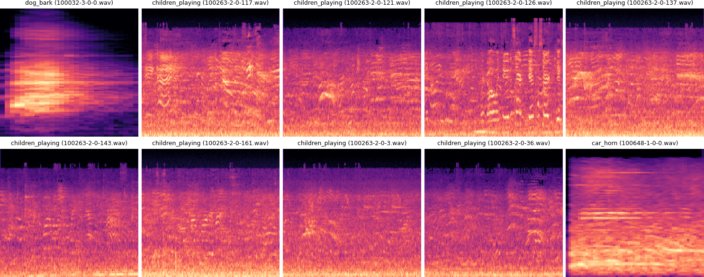

# mlx7-week5-audio-transformer

Adding another modality to my ML "toolbox" :)

mlx7-week5-audio-transformer/ 
├── README.md  
├── urban-sounds-classification/ # Task 1: urban sound classification 
├── whisper-speech-to-text/ # Task 2: fine tune Whisper and build a speech-controlled 'assistant' 
└── requirements.txt # dependencies 

## Task 1: Urban Sound Classification

Spectrograms on 10 examples from the UrbanSound8K dataset:

