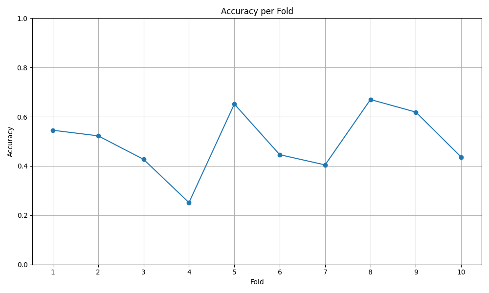

# mlx7-week5-audio-transformer

Adding another modality to my ML "toolbox" :)

## Task 1: urban sound classification 

From [urban-sounds-classification/notebooks/plot_spectrograms.ipynb](./urban-sounds-classification/notebooks/plot_spectrograms.ipynb)  notebook: 
spectrograms on 10 examples from the UrbanSound8K dataset

### Accuracy per Fold after 1 Training Epoch on All Folds:

More details on the approach I took: [Path to README](./urban-sounds-classification/README.md)

## Task 2: fine tune Whisper and build a speech-controlled 'assistant' 

whisper-speech-to-text/
